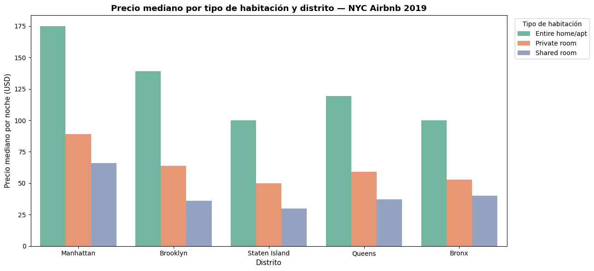
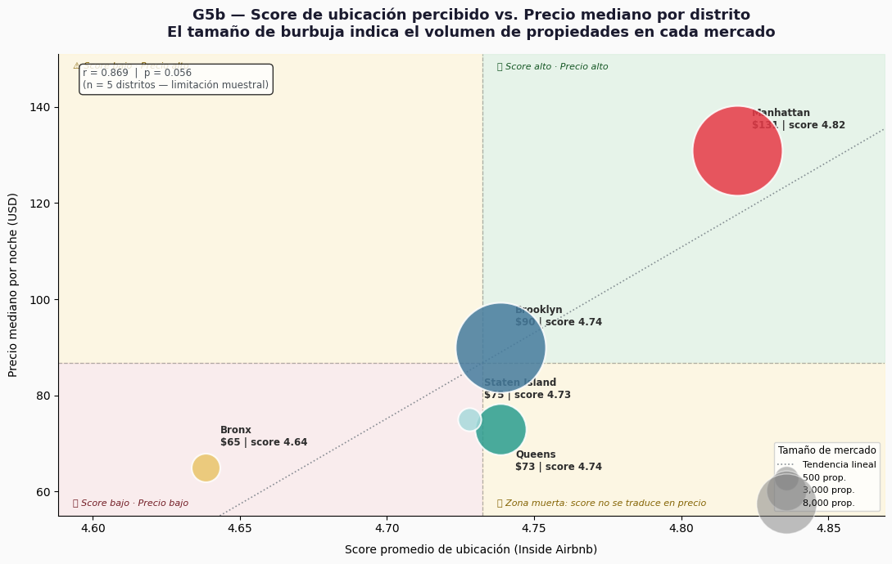
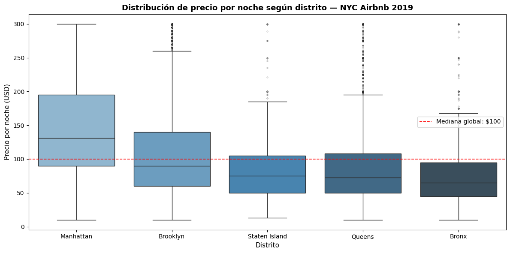
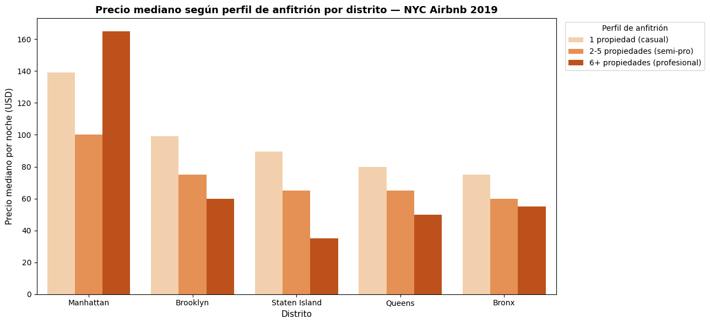
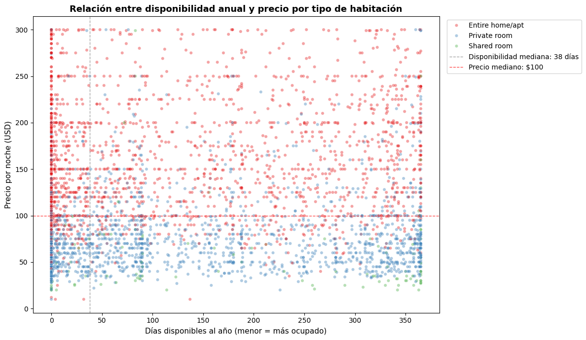

# Introducción de Big Data y Data Analytics

**Materia:**

Introducción de Big Data y Data Analytics

**Actividad:**

Proyecto: Turismo digital y precios de alojamiento

**Profesor:**

Alan Victor Raul Morante

**Integrantes:**

| Nombre | Rol | Participación |
|---|---|---|
| Dayra Alejandra Barboza Usco | Ingeniera de datos | 100% |
| Fabiana Marcela Gomez Chavez | Analista de datos | 100% |
| Dayanara Luz Rodriguez Rojas | Documentadora | 100% |
| Andrea Nicole Vera Tacilla | Analista de negocio | 100% |
| Ian Adiel Yucra Castro | Líder de proyecto | 100% |

---

## 1. Problema de Negocio

URBVI es una empresa de gestión e inversión inmobiliaria que busca identificar las características que generan mayores ingresos dentro del mercado de Airbnb en Nueva York para orientar sus decisiones de adquisición, gestión y fijación de precios de propiedades.

La pregunta de negocio que guía este proyecto es:

> ¿Cómo influyen los puntos de interés urbanos en la variabilidad del precio y la demanda de alojamientos Airbnb en Nueva York, y cómo puede una empresa utilizar esta información para maximizar ingresos?

Esta pregunta es estratégicamente relevante porque URBVI no invierte en cualquier propiedad: necesita saber exactamente qué combinación de ubicación, tipo de propiedad y modelo de gestión maximiza el retorno por noche. Una decisión de inversión sin este análisis es una apuesta. Con el análisis adecuado, es una decisión fundamentada.

El mercado Airbnb de NYC concentra decenas de miles de propiedades activas. Sin análisis de datos, es imposible distinguir qué variables tienen impacto real sobre el precio y cuáles son solo ruido. Este proyecto transforma datos públicos en una guía de decisión accionable para URBVI.

---

## 2. Los Datos

**Dataset base — Airbnb NYC (Kaggle, 2019):** 48,895 registros con precio, tipo de habitación, distrito, disponibilidad anual, reseñas y características del anfitrión.

**Dataset de enriquecimiento — Inside Airbnb:** Cuenta con puntuaciones de ubicación (review_scores_location) asignadas por huéspedes, agregadas por distrito para capturar la percepción del entorno urbano.

**Limpieza aplicada:** Se eliminaron columnas no analíticas, se imputaron nulos en reviews_per_month con 0, se filtraron precios fuera del rango representativo (≥$10 y ≤$300, correspondiente al percentil 99) y estancias mínimas superiores a 365 días. El dataset resultante quedó con 47,985 registros limpios.

**Metodología:** Se aplicaron los cuatro niveles de analítica: descriptiva, diagnóstica, predictiva y prescriptiva. Siguiendo las hipótesis formuladas en PC1.

---

## 3. Análisis Descriptivo — ¿Qué pasó en los datos?

### 3.1 Distribución de precios

| Estadístico | Valor |
|---|---|
| Mediana | $106/noche |
| Media | $153/noche |
| Percentil 90 | $269/noche |
| Skewness | 19.119 |

Manhattan se posiciona como el distrito más caro con una mediana que supera la mediana global ($106). Por otro lado, presenta la mayor variabilidad, existen opciones accesibles pero también alta concentración de propiedades premium. Brooklyn es el segundo más costoso pero con menor dispersión, lo que indica un mercado más homogéneo. Queens, Staten Island y Bronx se ubican por debajo de la mediana global con cajas más compactas.

### 3.2 Precio por distrito y tipo de habitación

El tipo de habitación sigue una jerarquía consistente en todos los distritos sin excepción: los Entire home/apt (casas/departamentos completos) son siempre los más caros, seguidos de Private room (cuarto privado) y luego Shared room (cuarto compartido). La combinación Entire home/apt + Manhattan produce la mediana más alta del mercado ($175/noche). Un Entire home/apt en Bronx o Staten Island ronda los $100, lo que muestra que el distrito actúa como multiplicador del valor base que establece el tipo de propiedad.

| Tipo | Entire home/apt | Private room | Shared room |
|---|---|---|---|
| Manhattan | $175/noche | $89 | $66 |
| Brooklyn | $139/noche | $64 | $36 |
| Queens | $119.5/noche | $59 | $37 |
| Staten Island | $100 | $50 | $30 |
| Bronx | $100 | $53 | $40 |

**Insight de negocio:** La decisión más rentable no consiste únicamente en invertir en una buena ubicación. El verdadero potencial económico surge cuando se combina una propiedad completa con un distrito de alta demanda. Esto explica por qué Manhattan concentra las tarifas más altas del mercado.

### 3.3 Ocupación vs. precio

La correlación entre precio y disponibilidad anual es de 0.058, prácticamente nula. Las propiedades del cuartil con menos días disponibles (más ocupadas) tienen una mediana de $100/noche, mientras que las del cuartil más disponible tienen $120/noche. El mercado premium no es el más ocupado.

### 3.4 Anfitriones por perfil

Los anfitriones se clasificaron en tres perfiles. A nivel agregado los casuales parecen cobrar más, pero esto es un artefacto: los semi-profesionales concentran el 64% de sus propiedades en Private room, el tipo más barato, lo que jala su mediana hacia abajo. Al controlar por tipo de habitación, el patrón se invierte completamente.

| Perfil | Definición | N° registros |
|---|---|---|
| Casual | 1 propiedad | 31,071 |
| Semi-profesional | 2–5 propiedades | 11,194 |
| Profesional | 6+ propiedades | 4,249 |

Precio mediano en Entire home/apt: casual $150, semi-profesional $150, profesional $180. En Private room: casual $70, semi-profesional $69, profesional $60. El patrón confirma que en propiedades completas la gestión profesional sí genera un precio superior.

### 3.5 Score de ubicación vs. precio (cruce de datasets)

| Distrito | Score ubicación | Precio mediano |
|---|---|---|
| Manhattan | 4.819 | $131 |
| Brooklyn | 4.739 | $90 |
| Queens | 4.739 | $75 |
| Staten Island | 4.729 | $73 |
| Bronx | 4.638 | $65 |

El cruce entre Inside Airbnb y Kaggle (precios) muestra una relación positiva: Manhattan lidera en ambas variables. Sin embargo, Staten Island tiene un score similar al de Queens pero no supera sus precios, y Brooklyn supera a Queens en precio con un score casi idéntico. La percepción de ubicación no explica el precio por sí sola.

---

## 4. Análisis Diagnóstico — ¿Por qué pasó lo que pasó?

### 4.1 Correlaciones clave

- availability_365 vs. Precio: 0.058 (nula) — precio y ocupación son independientes.
- reviews_per_month vs. precio: correlación negativa leve — mayor rotación se asocia a precios más bajos.
- Score de ubicación V.S Precio por distrito: 0.739

### 4.2 Validación de hipótesis

#### H1 — ¿El distrito pesa más que el tipo de habitación? = REFUTADA PARCIALMENTE

El rango de variación entre tipos de habitación es $145 (de $30 en Shared room Staten Island a $175 en Entire home/apt Manhattan); el rango entre distritos (mismo tipo Entire home/apt) es $75 (de $100 en Bronx/Staten Island a $175 en Manhattan). El tipo genera mayor dispersión de precio que el distrito por sí solo. Sin embargo, ambas variables interactúan: el mismo tipo (Entire home/apt) vale $175 en Manhattan y $100 en el Bronx. El precio premium máximo exige la combinación de ambas, no una sola variable en aislamiento.

#### H2 — ¿Mayor score de ubicación implica mayor precio? = CONFIRMADA CON MATIZ

Correlación de 0.756 entre score y precio medio por distrito. Manhattan lidera en ambas dimensiones. Sin embargo, el p-value es 0.154 (no significativo con 5 distritos), y Staten Island desafía la tendencia. El score es un indicador complementario, no un criterio único de inversión.

#### H3 — ¿Los anfitriones profesionales cobran más? = CONFIRMADA CON MATIZ

Al controlar por tipo de habitación, los profesionales cobran $180/noche en Entire home/apt frente a $150 de los casuales: una ventaja del 20% (+$30/noche). La gestión profesional tiene valor económico medible cuando se comparan propiedades equivalentes.

#### H4 — ¿Precio alto y alta ocupación son independientes? = CONFIRMADA

Correlación precio–disponibilidad de 0.058. Las propiedades premium ($300–$800) tienen disponibilidad mediana de 157 días/año; las económicas ($0–$75) solo 36 días. En NYC, barato = más ocupado. Precio y ocupación deben gestionarse como objetivos separados.

---

## 5. Análisis Predictivo — ¿Qué es probable que ocurra?

Se desarrollaron y compararon dos modelos para predecir el precio por noche de cualquier propiedad y en este caso las variables predictoras se seleccionaron con base en las hipótesis validadas, por ejemplo: tipo de habitación, distrito, perfil de anfitrión, minimum_nights, availability_365 y reviews_per_month.

| Modelo | R² | MAE |
|---|---|---|
| Regresión Lineal | 0.385 | $39.49/noche |
| Random Forest | 0.558 | $31.77/noche |

El Random Forest es el modelo recomendado: mejora el R² en +44.9% (de 0.385 a 0.558) y reduce el error promedio en $7.72/noche (de $39.49 a $31.77). Maneja mejor la interacción no lineal entre variables.

**Importancia de variables en el Random Forest (orden descendente):** tipo de habitación → distrito → disponibilidad → perfil de anfitrión → minimum nights → reseñas. Este ranking es completamente consistente con H1 y H3.

**Limitación:** El modelo tiene mejor desempeño en el rango $10 a $200/noche (90% del mercado). Para propiedades premium (>$300) la precisión disminuye por escasez de registros en ese rango; en esos casos se recomienda complementar con análisis de mercado específico.

---

## 6. Análisis Prescriptivo — ¿Qué debe hacer URBVI?

### 6.1 Escenario 1 — Maximizar precio por unidad (Manhattan)

**Supuesto:** URBVI adquiere Entire home/apt en Manhattan y opera con perfil profesional (pricing dinámico, atención al huésped estandarizada, mantenimiento preventivo).

- Precio base del segmento (casual): $150/noche (mediana real del dataset)
- Prima por gestión profesional: +$30/noche (validado en H3)
- Precio estimado con gestión profesional: $180/noche
- Ocupación supuesta: 200 noches/año (supuesto del equipo, ~55% del año)
- Ingreso anual estimado por unidad con gestión profesional: ~$39,000

Sin gestión profesional: precio base $150/noche × 200 noches → ingreso anual ~$30,000 → diferencia de ~$6,000 por unidad al año.

### 6.2 Escenario 2 — Maximizar ocupación (Brooklyn)

**Supuesto:** URBVI adquiere Private room en Brooklyn con precio competitivo ($70–$90/noche), priorizando alta rotación.

- Precio proyectado: ~$64/noche
- Ocupación estimada: 85% del año (basada en el cuartil de mayor ocupación del dataset)
- Ingreso anual estimado por unidad: ~$23,300

**Comparación directa:**

| Dimensión | Escenario 1 (Premium) | Escenario 2 (Ocupación) |
|---|---|---|
| Precio/noche | $180 | $64 |
| Ocupación estimada | 45% | 85% |
| Ingreso anual/unidad | $39,000 | $23,300 |
| Riesgo | Medio (mercado volátil) | Bajo (demanda sostenida) |

La cartera óptima combina ambas estrategias: propiedades premium en Manhattan para retorno alto, propiedades de alta rotación en Brooklyn para estabilidad de flujo de caja.

### 6.3 Escenario Combinado — Estrategia óptima de portafolio

**Supuesto:** URBVI combina la mejor ubicación disponible (Manhattan) con gestión profesional, y lo contrasta con la peor combinación posible (Bronx + gestión casual).

- Precio base Manhattan predicho por el modelo: $205/noche
- Prima por gestión profesional: +$30/noche (validado en H3)
- Precio estimado estrategia óptima: $235/noche
- Ocupación supuesta: 200 noches/año (supuesto del equipo, ~55% del año)
- Ingreso anual estimado estrategia óptima: ~$46,927

Estrategia base (Bronx + Casual): $134/noche × 200 noches → ingreso anual ~$26,733 → diferencial de ~$20,194 por unidad al año (75.5% más).

La cartera óptima no es solo elegir Manhattan ni solo profesionalizar — es la combinación de ambas decisiones la que maximiza el retorno. Ninguna variable por sí sola genera precio premium; es su interacción la que lo produce.

### 6.4 Recomendaciones estratégicas

**Recomendación 1 — Priorizar Entire home/apt en Manhattan**

H1 y el modelo Random Forest confirman que esta combinación produce el precio más alto del mercado ($175/noche base). Acción: Orientar 60% del presupuesto de adquisición a este segmento. Indicador de éxito: Precio promedio realizado >$175/noche en los primeros 12 meses.

**Recomendación 2 — Implementar gestión profesional en todo el portafolio**

H3 demostró una ventaja de $30/noche (+20%) sobre anfitriones casuales en propiedades equivalentes. Acción: Estandarizar operación con pricing dinámico semanal, atención al huésped protocolizada y mantenimiento preventivo. Indicador de éxito: Prima de precio sobre el mercado comparable ≥$40/noche a los 6 meses.

**Recomendación 3 — Gestionar precio y ocupación como objetivos independientes**

H4 demostró correlación de 0.058 entre precio y ocupación. Las estrategias que optimizan ambas simultáneamente sub optimizarán ambas. Definir KPIs diferenciados por segmento: precio objetivo para el portafolio Manhattan; ocupación mínima garantizada para el portafolio Brooklyn/Queens. Indicador de éxito: KPIs diferenciados definidos antes del tercer mes. Revisión trimestral por propiedad.

---

## 7. Limitaciones y Próximos Pasos

### 7.1 Limitaciones

El dataset corresponde a 2019 (pre-pandemia); los valores absolutos de precios pueden diferir del mercado actual, aunque los patrones estructurales se mantienen. El análisis opera a nivel de distrito, cuando Manhattan es internamente muy heterogéneo. La ocupación se estima con availability_365 (proxy), no con datos reales de reservas.

### 7.2 Próximos pasos prioritarios

1. Reentrenar el modelo con datos 2024–2025 para predicciones accionables hoy.
2. Bajar la granularidad al nivel de barrio cruzando con datos de proximidad a puntos de interés (Google Places / Foursquare).
3. Incorporar datos de ocupación real vía AirDNA para separar disponibilidad de demanda efectiva.

---

## Apéndice A — Uso de IA Generativa

**Proyecto:** Caso 3 — Turismo Digital y Precios de Alojamiento (URBVI)
**Herramienta utilizada:** Claude (Anthropic) — claude.ai

### Declaración de uso

El equipo utilizó Claude como herramienta de apoyo a lo largo del proyecto. Todos los análisis, interpretaciones, hipótesis y recomendaciones fueron revisados, validados y aprobados por el equipo. La IA no reemplazó el juicio analítico del grupo — fue utilizada como asistente para acelerar la implementación técnica y mejorar la calidad de la documentación.

### Registro de uso por etapa

#### 1. Limpieza y normalización de datos

**Prompt representativo:** "Tenemos un dataset de NYC Airbnb con 48,895 registros. El profesor nos pidió: eliminar columnas id, host_id, host_name, last_review, name; rellenar nulos en reviews_per_month con 0; eliminar duplicados; filtrar price entre 10 y 300; filtrar minimum_nights <= 365; y resetear índice. Genera el código en Python para Google Colab."

**Para qué se usó:** Generación del código de limpieza siguiendo las instrucciones exactas del profesor.

**Cómo se validó:** Se corrió el código en Google Colab y se verificó que el dataset resultante (45,514 registros, 11 columnas, 0 nulos) era consistente con lo esperado.

#### 2. Análisis de distribución y justificación del filtro de precio

**Prompt representativo:** "Necesitamos justificar por qué filtramos el precio a $300. Genera una celda con histograma de distribución de precios que muestre el sesgo, skewness, percentiles clave y el porcentaje de registros hasta $300."

**Para qué se usó:** Generación del gráfico de análisis de frecuencia y cálculo de estadísticos de distribución.

**Cómo se validó:** El skewness resultante (19.119) y el porcentaje de registros (93.1%) fueron verificados contra el dataset. El equipo confirmó que el corte en $300 era metodológicamente justificable.

#### 3. Análisis Exploratorio de Datos (EDA)

**Prompt representativo:** "Genera el código para un boxplot de precio por distrito (neighbourhood_group) con precios < $300, fondo oscuro con seaborn. Que muestre medianas, IQR y outliers."

**Para qué se usó:** Generación del código de los 5 gráficos del EDA (G1 al G5), incluyendo el boxplot por distrito, barras agrupadas por tipo de habitación, scatter de disponibilidad vs demanda, análisis de perfiles de anfitrión y gráfico de score de ubicación vs precio.

**Cómo se validó:** Cada gráfico fue revisado visualmente por el equipo y sus conclusiones fueron contrastadas con los datos reales antes de incorporarse al análisis.

#### 4. Validación de hipótesis

**Prompt representativo:** "Estas son nuestras 4 hipótesis refinadas con sus sustentos. Genera celdas de código que calculen los estadísticos necesarios para validar o refutar cada una: H1 rango de variación distrito vs tipo, H2 correlación score vs precio con p-value, H3 precio por perfil y tipo de habitación, H4 correlación precio vs disponibilidad."

**Para qué se usó:** Generación del código de validación formal de las 4 hipótesis con evidencia cuantitativa explícita.

**Cómo se validó:** Los outputs fueron comparados con los gráficos del EDA para verificar consistencia. El equipo revisó cada veredicto antes de aprobarlo.

#### 5. Modelo predictivo (Nivel 3)

**Prompt representativo:** "El profesor nos dijo que LabelEncoder está mal usado para variables nominales y que debemos usar One-Hot Encoding. También nos dijo que neighbourhood (200 barrios) predice mejor que neighbourhood_group (5 distritos). Genera el código corregido con pd.get_dummies y agrega neighbourhood, latitude y longitude como variables predictoras."

**Para qué se usó:** Corrección del modelo siguiendo las indicaciones del profesor. Generación del código de Regresión Lineal y Random Forest con las variables correctas, incluyendo la comparación de métricas (R² y MAE).

**Cómo se validó:** Se corrió el modelo en Google Colab y se verificaron las métricas obtenidas. El equipo confirmó que la mejora de R²=0.385 a R²=0.558 era consistente con las correcciones aplicadas.

#### 6. Escenarios y recomendaciones (Nivel 4)

**Prompt representativo:** "Genera el código para 3 escenarios cuantificados para URBVI. Escenario 1: usar el modelo Random Forest para predecir precio de Entire home/apt en cada distrito con perfil profesional y 200 noches/año. Escenario 2: usar medianas históricas para comparar profesional vs casual en Manhattan. Escenario combinado: Manhattan + profesional vs Bronx + casual."

**Para qué se usó:** Generación del código de los 3 escenarios prescriptivos con supuestos explícitos y cálculo de ingresos proyectados.

**Cómo se validó:** El equipo revisó los supuestos (200 noches/año, precios del modelo vs medianas históricas) y validó que los resultados eran coherentes con los hallazgos del EDA y las hipótesis.

#### 7. Dashboard interactivo HTML

**Prompt representativo:** "Genera un dashboard HTML con diseño tecnológico (fondo oscuro, tipografía Space Mono, acentos cyan) con 5 gráficos de Chart.js. Estructura: panel grande con el gráfico activo y 5 botones de navegación G1-G5 abajo. G4 y G5 deben mostrar imágenes reales de Power BI embebidas en base64."

**Para qué se usó:** Generación del dashboard HTML interactivo como entregable del proyecto, integrando los gráficos de Power BI con visualizaciones Chart.js.

**Cómo se validó:** El equipo revisó el dashboard en el navegador, verificó que los datos mostrados coincidían con los del análisis, y aprobó el diseño antes de subirlo al repositorio.

#### 8. Documentación y redacción

**Prompt representativo:** "Explícame de forma no técnica todo lo que hemos hecho en este notebook para que pueda explicárselo a mis compañeros."

**Para qué se usó:** Apoyo en la redacción de interpretaciones en lenguaje de negocio, explicaciones no técnicas de conceptos estadísticos (R², MAE, skewness, One-Hot Encoding) y generación de documentos de apoyo para el equipo.

**Cómo se validó:** Todas las interpretaciones fueron revisadas por el equipo y ajustadas según los datos reales antes de incorporarse al informe.
